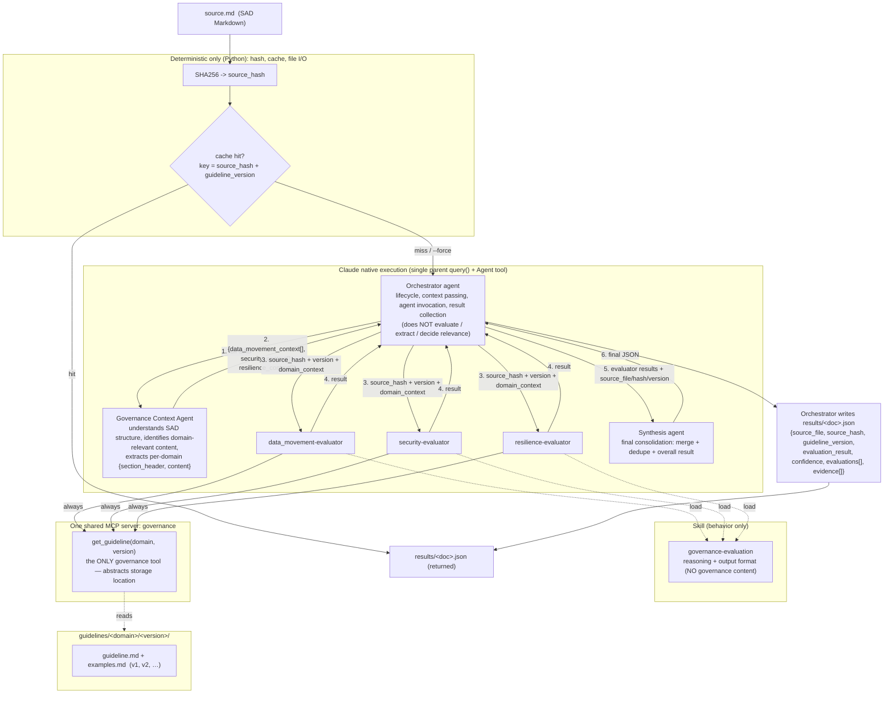

```mermaid
flowchart TD
    SAD["source.md  (SAD Markdown)"]

    subgraph DET["Deterministic only (Python): hash, cache, file I/O"]
        HASH["SHA256 -> source_hash"]
        CACHE{"cache hit?<br/>key = source_hash + guideline_version"}
    end

    SAD --> HASH --> CACHE
    CACHE -- "hit" --> OUT["results/&lt;doc&gt;.json (returned)"]
    CACHE -- "miss / --force" --> ORCH

    subgraph NATIVE["Claude native execution (single parent query() + Agent tool)"]
        ORCH["Orchestrator agent<br/>lifecycle, context passing, agent invocation, result collection<br/>(does NOT evaluate / extract / decide relevance)"]
        GCA["Governance Context Agent<br/>understands SAD structure, identifies domain-relevant content,<br/>extracts per-domain {section_header, content}"]
        DM["data_movement-evaluator"]
        SEC["security-evaluator"]
        RES["resilience-evaluator"]
        SYN["Synthesis agent<br/>final consolidation: merge + dedupe + overall result"]
    end

    %% Orchestrator -> Governance Context Agent -> back to Orchestrator
    ORCH -- "1. full SAD" --> GCA
    GCA -- "2. {data_movement_context[], security_context[], resilience_context[]}" --> ORCH

    %% Orchestrator -> evaluators (one per domain that has extracted content) -> back to Orchestrator
    ORCH -- "3. source_hash + version + domain_context" --> DM
    ORCH -- "3. source_hash + version + domain_context" --> SEC
    ORCH -- "3. source_hash + version + domain_context" --> RES
    DM -- "4. result" --> ORCH
    SEC -- "4. result" --> ORCH
    RES -- "4. result" --> ORCH

    %% Orchestrator -> Synthesis -> write
    ORCH -- "5. evaluator results + source_file/hash/version" --> SYN
    SYN -- "6. final JSON" --> ORCH
    ORCH --> WRITE["Orchestrator writes results/&lt;doc&gt;.json<br/>{source_file, source_hash, guideline_version,<br/>evaluation_result, confidence, evaluations[], evidence[]}"]
    WRITE --> OUT

    subgraph SKILL["Skill (behavior only)"]
        SK["governance-evaluation<br/>reasoning + output format (NO governance content)"]
    end
    DM & SEC & RES -. load .-> SK

    subgraph MCP["One shared MCP server: governance"]
        T1["get_guideline(domain, version)<br/>the ONLY governance tool — abstracts storage location"]
    end
    DM & SEC & RES -- "always" --> T1

    subgraph GUIDE["guidelines/&lt;domain&gt;/&lt;version&gt;/"]
        G["guideline.md + examples.md  (v1, v2, …)"]
    end
    T1 -. reads .-> GUIDE
```
