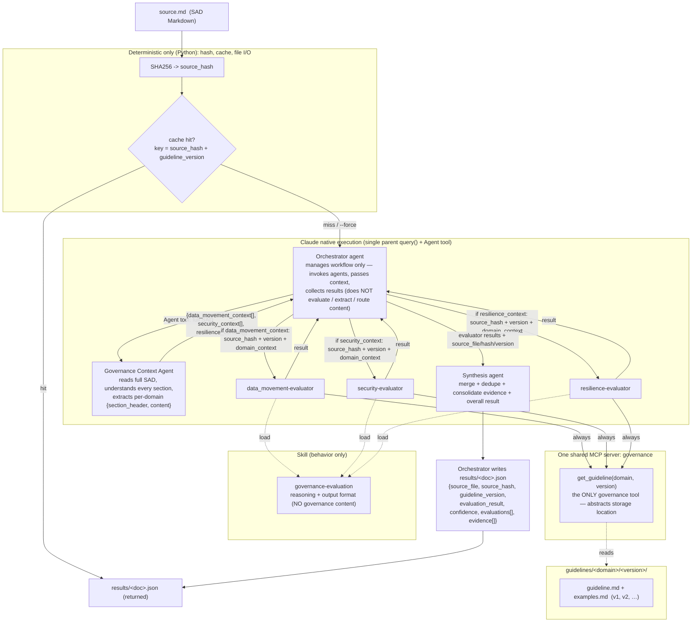

```mermaid
flowchart TD
    SAD["source.md  (SAD Markdown)"]

    subgraph DET["Deterministic only (Python): hash, cache, file I/O"]
        HASH["SHA256 -> source_hash"]
        CACHE{"cache hit?<br/>key = source_hash + guideline_version"}
    end

    SAD --> HASH --> CACHE
    CACHE -- "hit" --> OUT["results/&lt;doc&gt;.json (returned)"]
    CACHE -- "miss / --force" --> ORCH

    subgraph NATIVE["Claude native execution (single parent query() + Agent tool)"]
        ORCH["Orchestrator agent<br/>manages workflow only — invokes agents, passes context,<br/>collects results (does NOT evaluate / extract / route content)"]
        GCA["Governance Context Agent<br/>reads full SAD, understands every section,<br/>extracts per-domain {section_header, content}"]
        DM["data_movement-evaluator"]
        SEC["security-evaluator"]
        RES["resilience-evaluator"]
        SYN["Synthesis agent<br/>merge + dedupe + consolidate evidence + overall result"]
    end

    ORCH -- "Agent tool: full SAD" --> GCA
    GCA -- "{data_movement_context[], security_context[], resilience_context[]}" --> ORCH
    ORCH -- "if data_movement_context: source_hash + version + domain_context" --> DM
    ORCH -- "if security_context: source_hash + version + domain_context" --> SEC
    ORCH -- "if resilience_context: source_hash + version + domain_context" --> RES

    subgraph SKILL["Skill (behavior only)"]
        SK["governance-evaluation<br/>reasoning + output format (NO governance content)"]
    end
    DM & SEC & RES -. load .-> SK

    subgraph MCP["One shared MCP server: governance"]
        T1["get_guideline(domain, version)<br/>the ONLY governance tool — abstracts storage location"]
    end
    DM & SEC & RES -- "always" --> T1

    subgraph GUIDE["guidelines/&lt;domain&gt;/&lt;version&gt;/"]
        G["guideline.md + examples.md  (v1, v2, …)"]
    end
    T1 -. reads .-> GUIDE

    DM -- "result" --> ORCH
    SEC -- "result" --> ORCH
    RES -- "result" --> ORCH
    ORCH -- "evaluator results + source_file/hash/version" --> SYN
    SYN --> WRITE["Orchestrator writes results/&lt;doc&gt;.json<br/>{source_file, source_hash, guideline_version,<br/>evaluation_result, confidence, evaluations[], evidence[]}"]
    WRITE --> OUT
```
