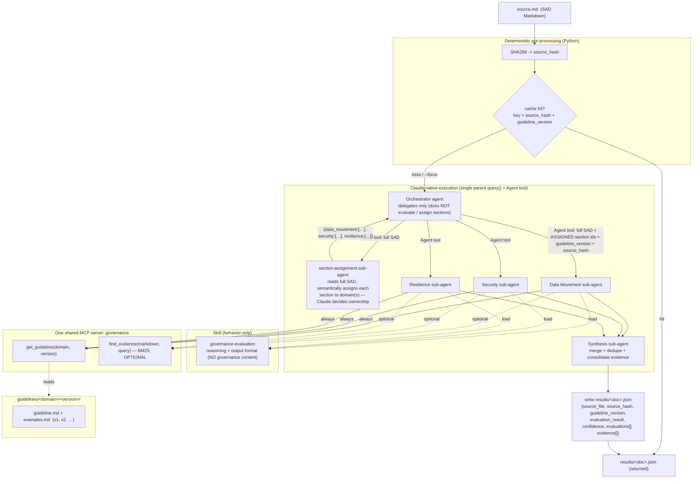

```mermaid
flowchart TD
    SAD["source.md  (SAD Markdown)"]

    subgraph DET["Deterministic pre-processing (Python)"]
        HASH["SHA256 -> source_hash"]
        CACHE{"cache hit?<br/>key = source_hash + guideline_version"}
    end

    SAD --> HASH --> CACHE
    CACHE -- "hit" --> OUT["results/&lt;doc&gt;.json (returned)"]
    CACHE -- "miss / --force" --> ORCH

    subgraph NATIVE["Claude native execution (single parent query() + Agent tool)"]
        ORCH["Orchestrator agent<br/>delegates only (does NOT evaluate / assign sections)"]
        ASSIGN["section-assignment sub-agent<br/>reads full SAD, semantically assigns each<br/>section to domain(s) — Claude decides ownership"]
        DM["Data Movement sub-agent"]
        SEC["Security sub-agent"]
        RES["Resilience sub-agent"]
        SYN["Synthesis sub-agent<br/>merge + dedupe + consolidate evidence"]
    end

    ORCH -- "Agent tool: full SAD" --> ASSIGN
    ASSIGN -- "{data_movement:[…], security:[…], resilience:[…]}" --> ORCH
    ORCH -- "Agent tool: full SAD + ASSIGNED section ids + guideline_version + source_hash" --> DM
    ORCH -- "Agent tool" --> SEC
    ORCH -- "Agent tool" --> RES

    subgraph SKILL["Skill (behavior only)"]
        SK["governance-evaluation<br/>reasoning + output format (NO governance content)"]
    end
    DM & SEC & RES -. load .-> SK

    subgraph MCP["One shared MCP server: governance"]
        T1["get_guideline(domain, version)"]
        T2["find_evidence(markdown, query) — BM25, OPTIONAL"]
    end
    DM & SEC & RES -- "always" --> T1
    DM & SEC & RES -. "optional" .-> T2

    subgraph GUIDE["guidelines/&lt;domain&gt;/&lt;version&gt;/"]
        G["guideline.md + examples.md  (v1, v2, …)"]
    end
    T1 -. reads .-> GUIDE

    DM --> SYN
    SEC --> SYN
    RES --> SYN
    SYN --> WRITE["write results/&lt;doc&gt;.json<br/>{source_file, source_hash, guideline_version,<br/>evaluation_result, confidence, evaluations[], evidence[]}"]
    WRITE --> OUT
```
